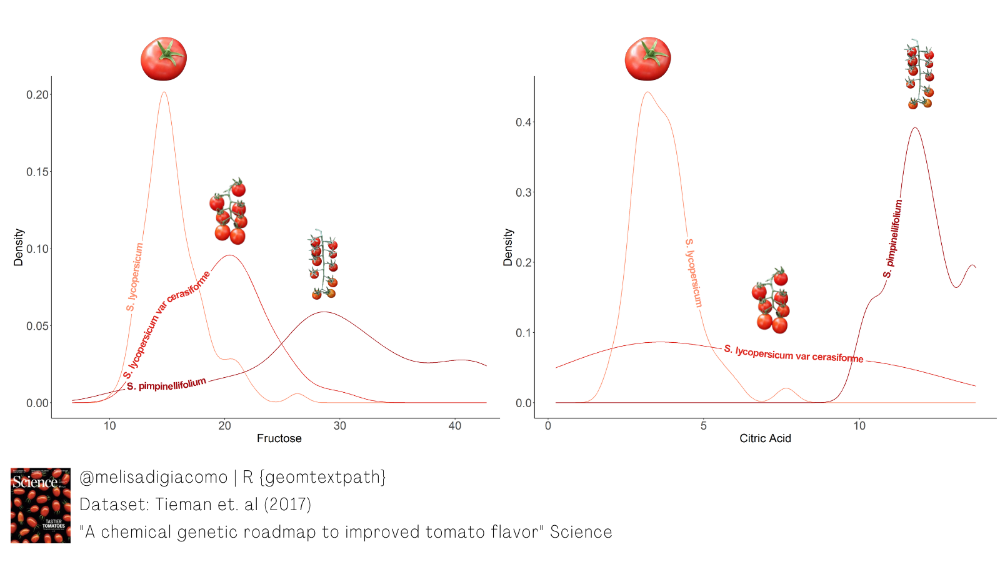
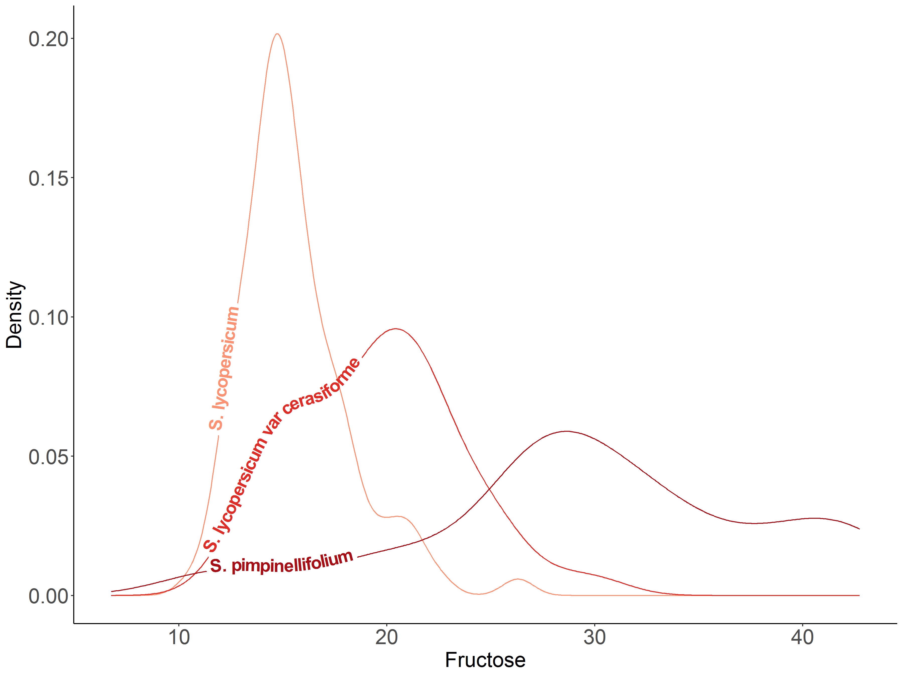

# {geomtextpath}

The R package {geomtextpath}, a ggplot2 extension, offers direct and automatic solutions for labeling.  
Easy and pretty text labels!  

I used it to show density plots of two metabolites (fructose and citric acid) that potentially contribute to flavor in three tomato botanical varieties.
Source: Table S1, Tieman et al. (2017)  

  
  
```r
# Density plot with automatic labels

# Libraries
library(ggplot2)
library(geomtextpath)

# Dataset
tomato = read.csv('tomato.csv', header=1)
```

```r
# Citric acid by botanical variety
ggplot(tomato, aes(x = citric_acid, colour = botanical_variety, label = botanical_variety)) +
  geom_textdensity(size = 6, fontface = 2, hjust = 0.2, vjust = 0.33) +
  labs(title="Citric acid content by tomato botanical varieties",
       caption="Source: Table S1, Tieman et al. 2017\n@melisadigiacomo") +
  xlab("Citric Acid") + ylab("Density") +
  scale_colour_manual(values = c("#fc9272", "#de2d26", "#a50f15")) +
  theme_classic() + theme(legend.position = "none", axis.text = element_text(size = 15), text = element_text(size = 15)) 
```

  

```r
# Fructose by botanical variety
ggplot(tomato, aes(x = fructose, colour = botanical_variety, label = botanical_variety)) +
  geom_textdensity(size = 6, fontface = 2, hjust = 0.15, vjust = 0.2) +
  labs(title="Fructose content by tomato botanical varieties",
       caption="Source: Table S1, Tieman et al. 2017\n@melisadigiacomo") +
  xlab("Fructose") + ylab("Density") +
  scale_colour_manual(values = c("#fc9272", "#de2d26", "#a50f15")) +
  theme_classic() + theme(legend.position = "none", axis.text = element_text(size = 15), text = element_text(size = 15))
``` 

  